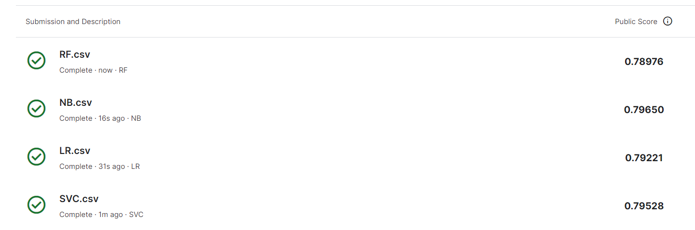

# NLP задача
Классификациия сообщения    
*Задча Kaggle - https://www.kaggle.com/competitions/nlp-getting-started/overview*

## Шаги выполнения задачи

1) Препроцессинг текста:
  - Нижний регистр
  - Токенезация
  - Удаление стоп слов
  - Лемматизация
2) Создал эмбеддинги TF-IDF
3) Сделал GridSearch по параметрам для моделей SVM, LogReg, NB, RF
4) Выбрал лучшуие параметры для каждой модели и обучил
5) Сделал предсказания на каждой модели и получил следующие метрики

</img>
